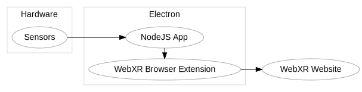

<h1 align="center"> O S X R     <small>Open Source XR</small></h1>

Enabling XR Websites on DIY Standalone VR Headsets.

(Icon Sources: VR Headset - <a href="https://www.freepik.com" title="Freepik">Freepik</a>; WebXR - <a href="https://immersive-web.github.io/" title="immersive-web.github.io">immersive-web.github.io</a>)

**Example:**

(Visible Webpage: https://immersive-web.github.io/webxr-samples/immersive-vr-session.html)

# Why?

The dominance of certain companies in the standalone VR sector calls for Open Source solutions to enable community-driven projects. This concept is a new approach towards supporting open-source standalone headsets.

# How?

*Standing on the shoulders of giants*: Using existing Free Open Source Software to bring existing WebXR experiences to existing hardware.

## Architecture

**Electron**: A framework for building web applications that run like native applications but in a browser context. Electron supports communicating with the underlying hardware.

* NodeJS App ~ communicates with the hardware
* WebXR Browser Extension ~ provides the WebXR API for the website based on the [WebXR Polyfill](https://github.com/immersive-web/webxr-polyfill))

**WebXR Website**: The WebXR API is the new standard for writing VR & AR experiences on the web. There are already many applications available that are all supported by this project through the WebXR API standard.

****

**Subprojects**

1. **OSXR Devices** - DIY hardware projects that are built for OSXR can be found under https://github.com/signinit/osxr-devices
2. **OSXR Desktop** - the default application that is included with this project can be found under *TBD*

# Status

Proof of concept: **DONE**
*Present a WebXR Website on DIY hardware (raspberry pi). Achieve a VR experience (3d-/stereoscopic-vision).*

Alpha Version: **In Progress**
*Build an OSXR Device solely by following the provided instructions. When starting the device, present an OSXR Desktop that can interact with the underlying hardware.*

# Contribution

This project needs enthusiasts from almost every field: Developers, Engineers, Designers, and everyone else that likes the idea of building their own VR Headset from scratch.

We are grateful for every contribution, idea, and opinion you like to share. **A good start** could be to check out the following development section or build a headset from [**OSXR Devices**](https://github.com/signinit/osxr-devices) or check out the current [**OSXR Desktop**]().

# Development

*The electron app provided in this project can be run on Windows, Linux & MacOS.*

Install the project's dependencies using `npm install`.
To start developing, run `npm run start:development`, which will start the electron app locally and restart it after any changes to the source code.

**Building** the application is made with `npm run build`. To get an installable application, use `npm run package`.
